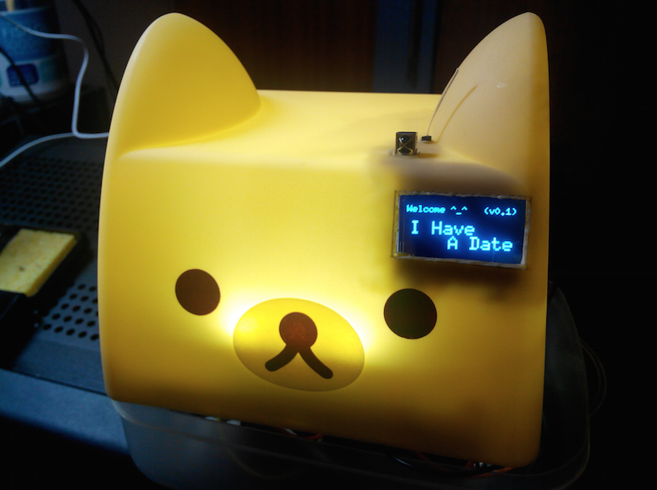
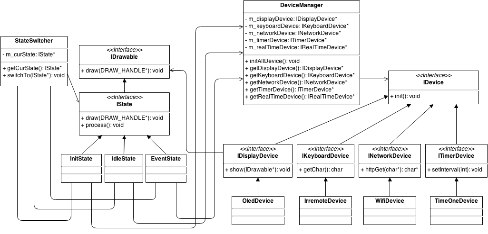

Arduino Smart Alarm
======
亲，开会又迟到了？又错过重要Session啦？忙到看手机都木有时间？
 
有时候，真的恨不得在办公室最显眼的地方摆个大闹钟，可是大忙人哪有空儿给闹钟设定时间呢！ 

I Have A Date 是一款基于网络自动同步的事件提醒闹钟，直接将公司的 GMail 邮箱的日程更新到闹钟里，准时提醒（超性感的液晶小屏幕，完整展现事件细节），从此绝不错过任何一个重要时刻 ^^！

程序结构图，其实已经 out of date 鸟。

代码正在 refactoring 中，整个 State Machine 部分已经被取掉，等全部修改完再更新这个图吧。

(Dragram drawed using [draw.io](https://www.draw.io/))
